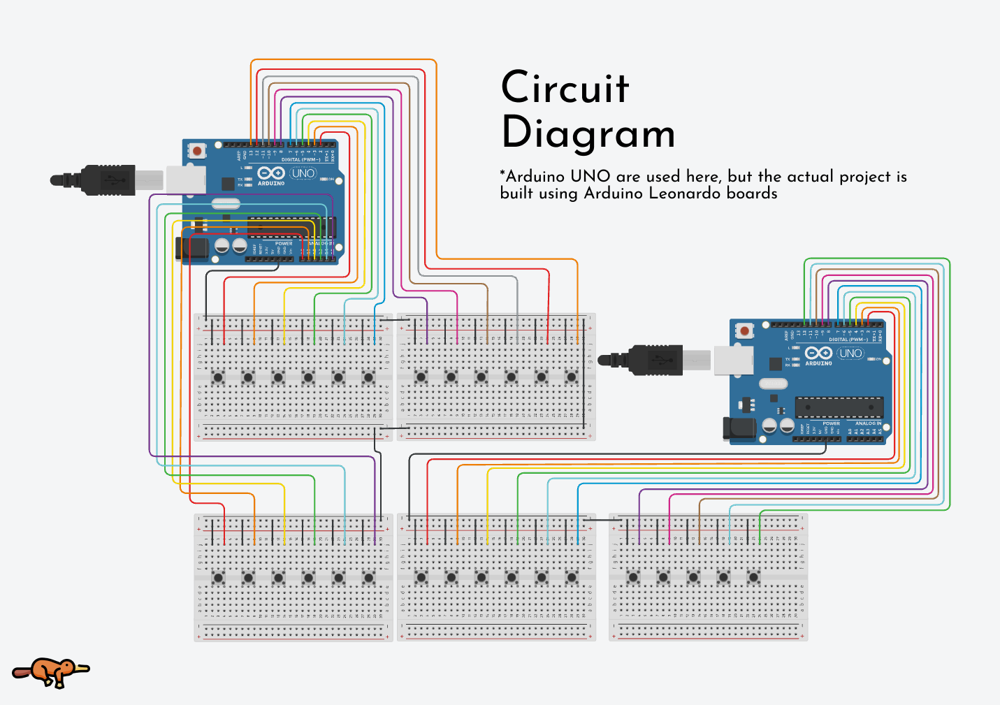

# MIDI Pedalboard Project 🎹

## Overview 📖
This project is a **29-note MIDI pedalboard** for an organ, built using two **Arduino Leonardo** boards. Each board is recognized as a **native USB-MIDI device**, allowing it to send MIDI messages directly to a computer without additional software. The pedals are made from 3D-printed components and use momentary push buttons.

It is designed to be used with any MIDI software that supports USB-MIDI. However, the main usecase is to be used with Hauptwerk.

## Features 🌟
- **29-note range** (C0 to E2)
- **Plug-and-play USB MIDI** 
- **3D-printed pedals** with momentary push buttons set

## Parts List
| Component                  | Quantity |
|----------------------------|----------|
| Arduino Leonardo           | 2        |
| Momentary push buttons  | 29       |
| Jumper wires               | 50+      |
| Breadboard (optional)       | 2        |
| USB cables (Micro/Mini)     | 2        |

## Wiring Guide 🔌
### **Arduino #1 (First 14 notes: C0–F1)**
- **Pins Used**: 2–13, A0  
- **Wiring**:
  - One side of each button goes to an **Arduino pin**.
  - The other side connects to **GND**.

### **Arduino #2 (Next 11 notes: F#1–E2)**
- **Pins Used**: 2–12  
- **Wiring**:
  - One side of each button goes to an **Arduino pin** with its pull-up resistor enabled.
  - The other side connects to **GND**.

## Diagram 📊

## Setup & Usage 🎹 💻 🎧 
1. **Upload the sketches** to the respective **Arduino Leonardo** boards using the Arduino IDE.
2. **Connect both Arduinos** to the computer via USB.
3. The devices will be detected as **MIDI controllers**.
4. Open any **MIDI-compatible software** (Hauptwerk, GrandOrgue, DAW, etc.) and assign the MIDI inputs.
5. **Test the keys** by pressing the pedals and ensuring the correct MIDI notes are sent.

## Troubleshooting 🤔
- **Some keys are not responding?**
  - Check the wiring (ensure one side of the button is connected to the correct pin and the other to **GND**).
  - Verify that the **Arduino pins are set to INPUT_PULLUP**.
- **Arduino not detected as MIDI device?**
  - Make sure you're using an **Arduino Leonardo** (or another board with native USB-MIDI support).
  - Try a different USB cable/port.
- **Buttons triggering multiple notes?**
  - Ensure there are no accidental short circuits between button connections.
  - Make sure that all the pins in the arduino are connected, or there may be weird glitches like this.

## Future Improvements 🔮
- Add a **multiplexer** to use a single Arduino for all notes.
- Implement **velocity sensitivity** using force-sensitive resistors (FSRs) instead of basic push buttons.
- Add potentiometers to control the velocity of the notes.

---

## Open Source Contribution 🤝
This project is **open-source** under the **MIT License**, meaning you are free to use, modify, and distribute it with proper attribution. If you improve or extend the project, consider contributing back!

### How to Contribute 
1. **Fork the repository** on GitHub.
2. **Clone your fork** and make modifications.
3. **Submit a pull request (PR)** with a detailed description of your changes.
4. Your PR will be reviewed, and if accepted, it will be merged into the main branch.

### Ideas for Contributions 💡
- **Hardware Enhancements**:
  - Improve the pedal design.
  - Explore different button mechanisms (e.g., optical switches).
- **Software Features**:
  - Implement **velocity sensitivity**.
  - Add support for **MIDI CC messages** for pedal dynamics.
- **Code Optimization**:
  - Refactor the MIDI message handling.
  - Improve latency and responsiveness.
- **Expand Compatibility**:
  - Support additional MIDI mappings.
  - Integrate with alternative microcontrollers.
---
 This project is open-source and community-driven. Let's build something amazing together! 🚀

## License 📜
This project is open-source under the MIT License. See the LICENSE file for more details.
